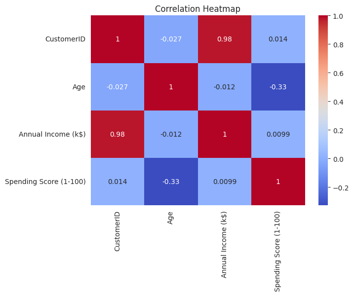
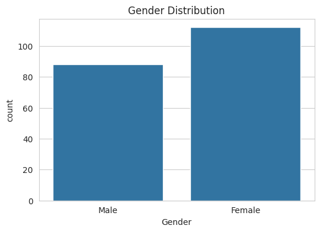
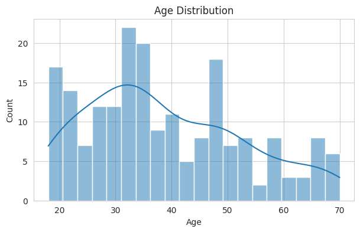
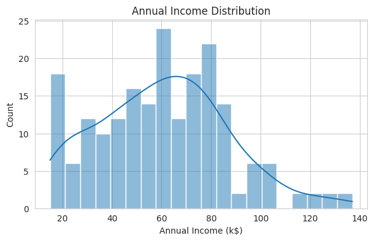
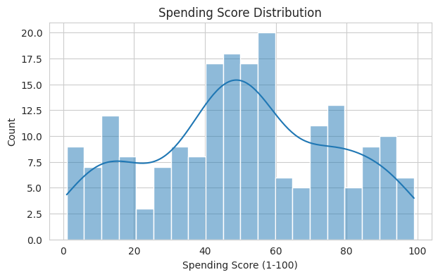
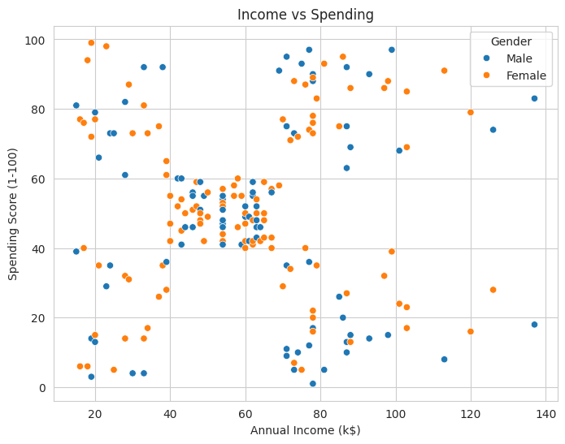
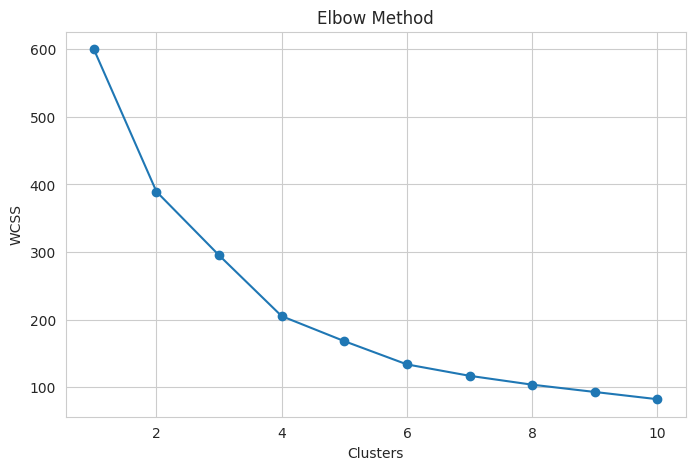

# PRODIGY_ML_02

## Customer Segmentation using K-Means Clustering

This project is a part of the **Prodigy Infotech Machine Learning Internship (Task-02)**.

The objective of this project is to segment retail customers into different groups using the **K-Means Clustering** algorithm based on their purchasing behavior.

---

## 📌 Objective

To group customers of a retail store into different clusters based on:

- Age
- Annual Income
- Spending Score

Customer segmentation helps businesses understand customer behavior and create targeted marketing strategies.

---

## 📂 Dataset

**Dataset Used:** Mall Customers Dataset

Features:

- CustomerID
- Gender
- Age
- Annual Income (k$)
- Spending Score (1-100)

Dataset Source:
https://www.kaggle.com/datasets/vjchoudhary7/customer-segmentation-tutorial-in-python

---

## 🛠️ Technologies Used

- Python
- Google Colab
- Pandas
- NumPy
- Matplotlib
- Seaborn
- Scikit-Learn

---

## 🤖 Machine Learning Algorithm

- K-Means Clustering

---

## 📊 Project Workflow

- Import Libraries
- Load Dataset
- Data Exploration
- Data Visualization
- Feature Scaling
- Elbow Method
- K-Means Clustering
- Cluster Visualization
- Silhouette Score Evaluation
- Export Clustered Dataset

---

## 📁 Project Structure

```
PRODIGY_ML_02/
│
├── customer_segmentation.ipynb
├── Mall_Customers.csv
├── Clustered_Customers.csv
├── requirements.txt
├── README.md
│
└── IMAGES/
    ├── AGE_DISTRIBUTION.png
    ├── ANNUAL_INCOME_DISTRIBUTION.png
    ├── elbow_method.png
    ├── GENDER_DISTRIBUTION.png
    ├── heatmap.png
    ├── income_vs_spending.png
    └── SPENDING_SCORE_DISTRIBUTION.png
```

---

## 📈 Output Visualizations

### Correlation Heatmap



---

### Gender Distribution



---

### Age Distribution



---

### Annual Income Distribution



---

### Spending Score Distribution



---

### Income vs Spending



---

### Elbow Method



---

## 📊 Results

- Customers were successfully grouped into **5 clusters**.
- The Elbow Method was used to determine the optimal number of clusters.
- Feature scaling improved clustering performance.
- The Silhouette Score was calculated to evaluate cluster quality.
- The clustered dataset was exported as **Clustered_Customers.csv**.

---

## 🎯 Conclusion

The K-Means Clustering algorithm successfully segmented retail customers into different groups based on **Age, Annual Income, and Spending Score**.

These customer segments can help businesses:

- Understand customer behavior
- Identify high-value customers
- Improve customer retention
- Create personalized marketing campaigns

---

## 👨‍💻 Author

**Name:** Max Purie

**Internship:** Prodigy Infotech

**Task:** PRODIGY_ML_02
